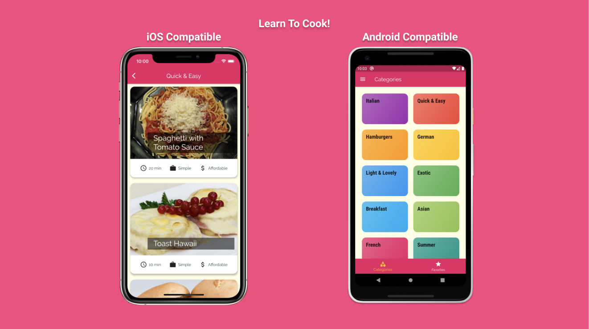
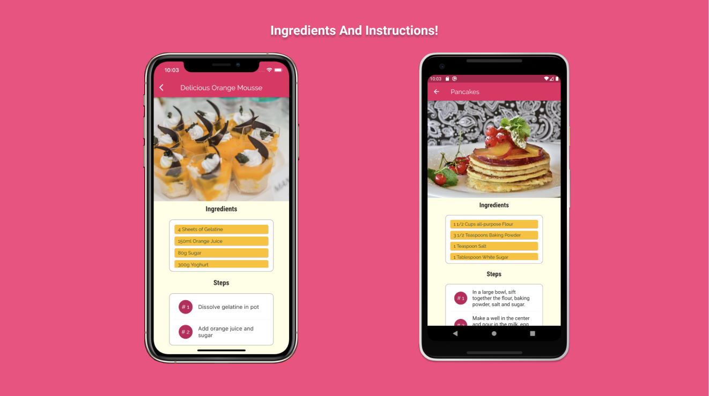
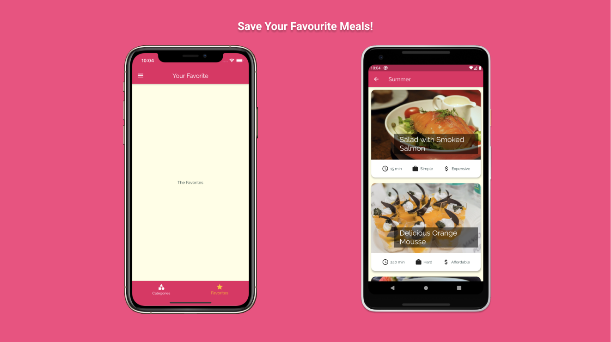

# Flutter RecipesApp
Project Name: Recipes App  
Project Date: Novemeber 2020  
Technologies Used: Dart  
Project Description: Cross platform compatible mobile app developed with Flutter allowing users to browse through a plethora of meal categories. View meals and see required ingredients and steps! Save your favourite meals!  

## Features

* Open Source
* iOS Compatible
* Android Compatible
* Easy to Use
* Browse by category to discover recipes
* View ingredients and Instructions of meals
* Save your favourite recipes
* Filter Through Multiple Categories
* Efficiently Optimized For Small App Size

## Table of Contents
1. [ScreenShots](#screenshots)
2. [Installation](#installation)

## Screenshots

## Installation

## Suggestions
Open to any suggestions and help provided.
